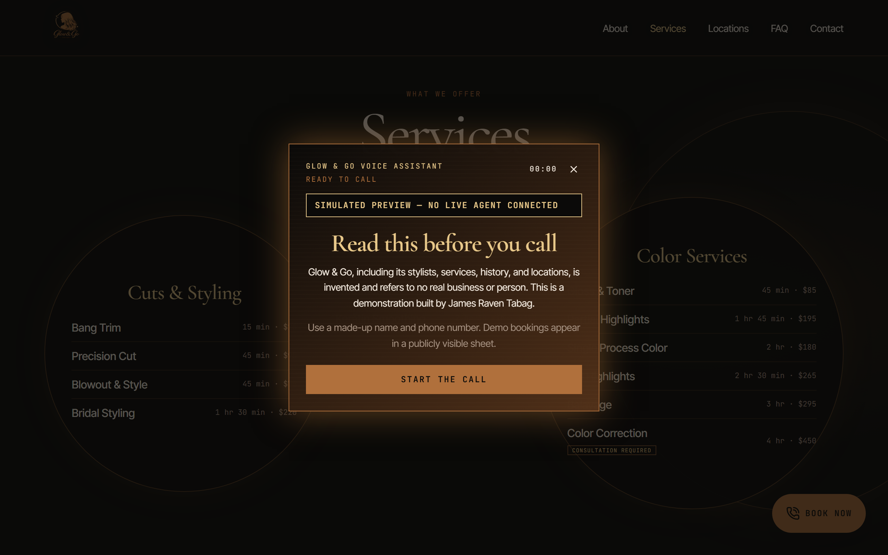

# Glow & Go Voice Agent

An AI voice receptionist portfolio demo for a fictional Los Angeles hair salon, built by James
Raven Tabag.

[View the live demo](https://glowngo-voiceagentdemo.site). Fresh clones default to safe simulated
mode with a clearly visible simulation badge.

The salon is fictional and the public booking sheet contains synthetic data only.

## Problem

Salons lose time and potential bookings when staff must interrupt client work to answer routine
questions, check availability, and manage appointments. This project demonstrates how an AI voice
receptionist can handle that workflow without a human receptionist.

## Solution

Visitors speak with an ElevenLabs agent in the browser. The hosted agent answers from a generated
knowledge base and calls n8n webhooks to check availability or update Google Sheets. A deterministic
18-second simulated conversation preserves the experience when live credentials are unavailable.

## Features

- Voice appointment booking through an ElevenLabs agent
- Real-time availability checks before booking
- Rescheduling and cancellation secured by a booking reference code
- Knowledge-base answers about services, stylists, locations, hours, and policies
- Safe simulated fallback with a persistent disclosure badge
- Keyboard, focus, reduced-motion, and screen-reader accessibility
- Responsive desktop and mobile experience

## Screenshots





## Tech stack

| Layer | Technology |
|---|---|
| Frontend | Next.js App Router, TypeScript, Tailwind CSS, shadcn/ui, Motion for React, Lucide |
| Voice | ElevenLabs Agents, `@elevenlabs/react`, browser microphone over WebRTC |
| Automation | n8n webhooks |
| Data | Google Sheets |
| Deploy | Cloudflare Workers via `@opennextjs/cloudflare`; n8n on a Docker VPS |

## Architecture

```text
Browser ──WebRTC──> ElevenLabs Agent ──webhook──> n8n ──> Google Sheets
```

The browser is never in the booking path. In live mode, the Next.js app has no booking backend and
holds no booking secrets. ElevenLabs hosts the agent, and its four webhook tools call n8n directly.
`app/api/mock/*` is the simulated implementation and executable contract specification, not a
dependency of the live booking path.

`content/` is the single source of truth for salon information. `pnpm generate:kb` generates
[`integrations/knowledge-base.md`](integrations/knowledge-base.md), keeping the website and agent
knowledge aligned.

## Setup

```bash
pnpm install
pnpm dev
```

Open [http://localhost:3000](http://localhost:3000). Setup is zero-config by default: without a live
agent ID, the app safely uses the scripted simulated experience. Live calls use the browser
microphone and display a visible consent and privacy disclosure before connecting. See the
[`docs/runbook.md`](docs/runbook.md) how-to for the live ElevenLabs, n8n, and Google Sheets wiring.

## Usage / Scripts

| Command | Purpose |
|---|---|
| `pnpm dev` | Run the local Next.js development server. |
| `pnpm build` | Create the production build and catch integration/build errors. |
| `pnpm start` | Serve an existing production build locally. |
| `pnpm lint` | Check the codebase with ESLint. |
| `pnpm typecheck` | Run TypeScript without emitting files. |
| `pnpm test` | Run the Vitest unit and contract tests once. |
| `pnpm test:e2e` | Build in simulated mode, then run the Playwright release gate. |
| `pnpm test:e2e:report` | Run the end-to-end suite, generate Allure HTML, and open it. |
| `pnpm allure:generate` | Generate the Allure HTML report from existing results. |
| `pnpm allure:open` | Open the generated Allure report locally. |
| `pnpm check:bloat` | Check production assets and dependencies against repository size budgets. |
| `pnpm generate:kb` | Regenerate the agent knowledge-base artifact from `content/`. |
| `pnpm crop:storefront` | Reproduce the storefront crop from the supplied location asset. |
| `pnpm preview` | Build and preview the Cloudflare Worker locally. |
| `pnpm run deploy` | Build and deploy the site to Cloudflare Workers. |
| `pnpm cf-typegen` | Generate Cloudflare environment types. |

## Testing

`pnpm test:e2e` builds the production app and runs the Playwright gate in desktop and mobile
Chromium projects. It verifies page structure and navigation, responsive floating-call behavior,
keyboard and focus accessibility, the always-visible simulated-mode badge, deterministic transcript
timing, and the mock booking webhook contracts—including reference-code requirements and malformed
request handling.

The gate deliberately runs in simulated mode. It does not assert microphone permissions, WebRTC
connectivity, ElevenLabs model behavior, n8n availability, Google credentials, or live writes to
Sheets. Those external integrations require a manual smoke test after the live wiring is complete.

Each end-to-end run writes fresh results to `allure-results/`. Use `pnpm test:e2e:report` for the
complete run-and-report flow, or the `allure:*` scripts to work with existing results.

## Limitations

- **No transactional lock in Sheets.** Two simultaneous booking requests can both observe a free
  slot before either writes its row.
- **Stylists have no individual working patterns.** The model has no days off, shifts, or breaks;
  all 12 stylists are available during every branch opening hour.
- **The mock store is not durable.** Its module-level state does not persist reliably across
  serverless instances because it is a reference implementation, not production storage.
- **The live voice path is not covered by CI.** Playwright cannot drive a real microphone or make
  deterministic assertions about a live LLM conversation.

## Project status

Version 1.0.0 is shipped and live. See the [changelog](docs/CHANGELOG.md) and
[release checklist](docs/v1.0.0-release-checklist.md). The live voice, booking, rescheduling, and
cancellation path was verified with a manual smoke test for the release.
